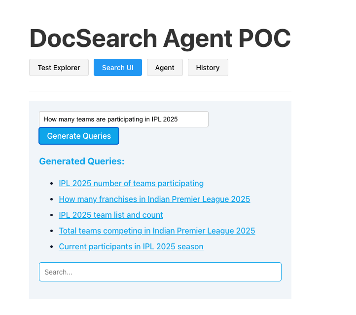
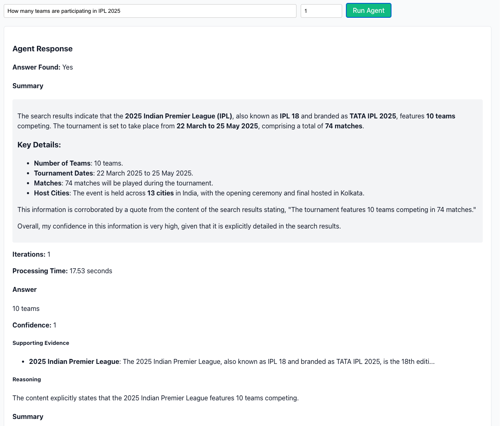

# DocSearchAgentPOC

## 1. Overview

Modern Content Management Systems (CMS) contain vast amounts of unstructured data. Traditional keyword search is often insufficient for complex queries or research tasks. Agentic search leverages LLM-powered agents to iteratively generate, refine, and analyze search queries, providing more relevant and context-aware results. Local LLMs and agents (such as vLLM, Qwen 2.5) can be used for privacy, cost, and latency benefits, enabling organizations to run advanced search workflows without relying solely on cloud APIs.

## 2. Objective

This project is a Proof of Concept (POC) for an agent-based search system using Microsoft Autogen. The implementation supports both OpenAI models and local LLMs, demonstrating flexible agent orchestration. The core agent (`advanced_knowledge_agent`) automates the process of query generation, search, and answer synthesis over a CMS (backed by Elasticsearch and Wikipedia dumps).

The agent flow is as follows:
- Receives a user question.
- Generates multiple search queries using an LLM.
- Executes searches and analyzes results.
- Refines queries iteratively if needed.
- Synthesizes a final answer, citing sources.

### Agent Flow Illustration

- 
- 

These images show how the agent generates search terms for a question and produces a final answer.

## 3. Example Query: IPL 2025 Teams

**User Query:**  
"List all teams participating in IPL 2025."

**Agent Steps:**
- Generates queries like "IPL 2025 teams", "Indian Premier League 2025 participants", etc.
- Searches the CMS for relevant documents.
- Analyzes results and extracts the list of teams.
- Returns a structured answer with references.

## 4. Tech Stack

- **Python Libraries:** autogen, openai, elasticsearch, python-dotenv, chainlit, flask, streamlit
- **LLMs:** vLLM, Qwen 2.5, OpenAI GPT models
- **UI Libraries:** React, Vite, TailwindCSS, @elastic/react-search-ui
- **Database:** SQLite (for logging and intermediate results)
- **Search Backend:** Elasticsearch

## 5. Setup Instructions

1. **Clone the repository:**
   ```sh
   git clone <repo-url>
   cd DocSearchAgentPOC
   ```

2. **Create a `.env` file:**
   - Copy `sample.env` to `.env` and fill in the required values (Elasticsearch, OpenAI API key, etc.).

3. **Install Python dependencies:**
   ```sh
   pip install -r requirements.txt
   ```

4. **Install UI dependencies:**
   - For the main UI (Vite/React):
     ```sh
     cd ui
     npm install
     ```
   - For the Elasticsearch search UI:
     ```sh
     cd ../es-search-ui
     npm install
     ```

5. **Run the backend:**
   ```sh
   python app.py
   ```

6. **Run the UI:**
   - In `ui` or `es-search-ui` folder:
     ```sh
     npm run dev
     ```

7. **(Optional) Start Elasticsearch:**
   - Use the provided `elastic/docker-compose.yml` to spin up Elasticsearch if not already running.

---

This README provides a comprehensive overview, objective, example, tech stack, and setup steps for your project.
